# Konthora — Real-Time Multilingual Voice-to-Production AI Agent 🎙️⚡

> Built for the **AssemblyAI Hackathon**. Konthora is a high-performance, real-time voice assistant that seamlessly combines streaming speech recognition, ultra-fast LLM reasoning, and natural speech synthesis.

---

## 🌟 Features

- **AssemblyAI Streaming v3 Integration**: Sub-second real-time speech recognition using AssemblyAI's WebSocket v3 API (`universal-3-5-pro` model / 16kHz PCM stream).
- **Dynamic Multilingual Intelligence**: Powered by Groq's high-speed inference engine (`qwen/qwen3.8-27b`), supporting English, Bangla, and Banglish natively.
- **On-Device Kokoro Speech Synthesis**: Low-latency local text-to-speech engine generating high-fidelity audio buffers.
- **Acoustic Echo Guard**: Intelligent state management that mutes the microphone stream during TTS playback to prevent audio feedback loops.
- **Modern Responsive Interface**: Next.js frontend styled with Konthora's sleek dark-mode aesthetic.

---

## 🛠️ Tech Stack

- **STT (Speech-to-Text)**: AssemblyAI Streaming v3 WebSocket API
- **LLM Engine**: Groq API (Qwen 3.8 27B / Llama 3.3 70B) via `httpx` async client
- **TTS (Text-to-Speech)**: Kokoro TTS (`af_heart` phonetic synthesis)
- **Backend**: FastAPI (Python 3.10+), `websockets`, `asyncio`, Uvicorn
- **Frontend**: Next.js 14, Tailwind CSS, Web Audio API

---

## 🏗️ System Architecture

```mermaid
sequenceDiagram
    autonumber
    actor User as User (Mic & Speaker)
    participant Web as Next.js Web Client
    participant Server as FastAPI WebSocket Gateway
    participant AAI as AssemblyAI Streaming v3 API
    participant LLM as Groq LLM (Qwen 3.8 27B)
    participant TTS as Kokoro TTS Engine

    User->>Web: Speaks (Audio stream)
    Web->>Server: 16kHz Mono PCM Audio Chunks (Binary)
    Server->>AAI: Forward raw PCM buffer over WebSocket
    AAI-->>Server: Partial Transcripts (Interim Turns)
    Server-->>Web: {"type": "transcript", "text": "...", "final": false}
    Web-->>User: Render live speech-to-text in real time
    
    AAI-->>Server: Final Transcript (Turn End: true)
    Server-->>Web: {"type": "transcript", "text": "...", "final": true}
    
    rect rgb(20, 24, 39)
        Note over Web: Acoustic Echo Guard Activated (Mic Muted)
    end

    Server->>LLM: Stream context & prompt (English / Bangla)
    LLM-->>Server: Generated AI conversational response
    Server-->>Web: {"type": "text_response", "text": "..."}
    
    Server->>TTS: Phonetic synthesis (af_heart)
    TTS-->>Server: Synthesized audio PCM buffer (WAV)
    Server-->>Web: Binary audio buffer
    Web->>User: Playback AI response audio
    
    Note over Web: Audio finishes -> Acoustic Echo Guard Unmutes Mic
```



### 🔁 Pipeline Breakdown

1. **Client Audio Capture (16kHz PCM)**:
   The Next.js client accesses user microphone audio via `AudioContext` and an `AudioWorkletNode` (with graceful fallback), downsampling native audio to 16,000Hz 16-bit linear PCM and sending raw binary frames over a persistent WebSocket.

2. **AssemblyAI Streaming v3 Proxy**:
   The FastAPI gateway initiates a secure bidirectional connection to AssemblyAI's `wss://streaming.assemblyai.com/v3/ws?sample_rate=16000` using the `universal-3-5-pro` model. Interim and final turn transcripts are instantly routed back to the browser.

3. **Ultra-Low Latency LLM Reasoning**:
   Once AssemblyAI emits an `end_of_turn: true` event, the transcript is passed to Groq's low-latency inference API using `qwen/qwen3.8-27b` (or Llama 3.3 70B), optimized for snappy, conversational dialogue in English and Bengali.

4. **On-Device Kokoro Speech Synthesis**:
   The LLM reply is synthesized on-the-fly into warm, natural speech using Kokoro-82M. The synthesized audio bytes are streamed back to the frontend for immediate playback.

5. **Acoustic Echo Guard**:
   To prevent self-triggering feedback loops where the microphone picks up speaker output, the client automatically pauses microphone frame dispatch during TTS playback.

---

## 🚀 Quick Start

### 1. Prerequisites

- **Python 3.10+**
- **Node.js 18+** & `npm`
- **eSpeak NG** (required for phonetic TTS synthesis)
  - *Windows*: Download from [eSpeak NG releases](https://github.com/espeak-ng/espeak-ng/releases) or verify installation at `C:\Program Files\eSpeak NG`.
  - *Ubuntu/Debian*: `sudo apt-get install espeak-ng`
  - *macOS*: `brew install espeak-ng`
- **FFmpeg** (for audio transcoding)
  - *Windows*: `winget install Gyan.FFmpeg`
  - *Ubuntu/Debian*: `sudo apt-get install ffmpeg`
  - *macOS*: `brew install ffmpeg`

---

### 2. Environment Configuration

1. In the `backend/` directory, create a `.env` file from `.env.example`:
   ```bash
   cp backend/.env.example backend/.env
   ```
2. Populate your secret API keys in `backend/.env`:
   ```env
   ASSEMBLYAI_API_KEY=your_assemblyai_api_key_here
   GROQ_API_KEY=your_groq_api_key_here
   GROQ_MODEL=qwen/qwen3.8-27b
   ```

---

### 3. Backend Setup

```bash
cd backend

# Create and activate virtual environment
python -m venv .venv

# Windows (PowerShell)
.venv\Scripts\Activate.ps1
# Linux / macOS
source .venv/bin/activate

# Install dependencies
pip install -r requirements.txt

# Launch FastAPI backend
python -m uvicorn app.main:app --host 0.0.0.0 --port 8000 --reload
```

---

### 4. Frontend Setup

In a new terminal window:

```bash
# In the project root
npm install

# Run Next.js development server
npm run dev
```

Open [http://localhost:3000/voice-agent](http://localhost:3000/voice-agent) in your browser to interact with the real-time voice agent.

---

## 📡 WebSocket API Specification

### Endpoint: `/api/v1/ws/voice-agent`

#### Client to Server
- **Binary Stream**: 16kHz, 16-bit Mono PCM audio chunks.
- **Text Message**: Optional string input for test or fallback chat interactions.

#### Server to Client
- **Transcript Event**:
  ```json
  {
    "type": "transcript",
    "text": "Hello world",
    "role": "user",
    "final": false
  }
  ```
- **Text Response Event**:
  ```json
  {
    "type": "text_response",
    "text": "Hello! How can I help you today?",
    "role": "assistant"
  }
  ```
- **Binary Stream**: Synthesized WAV audio buffer for speaker playback.

---

## 📂 Project Structure

```
├── backend/
│   ├── app/
│   │   ├── api/v1/
│   │   │   ├── voice_agent.py        # AssemblyAI v3 WebSocket proxy & handler
│   │   │   ├── tts.py                # Text-to-Speech endpoints
│   │   │   └── transcription.py      # Audio transcription endpoints
│   │   ├── services/
│   │   │   ├── voice_agent_service.py # Groq LLM & Kokoro TTS integration
│   │   │   └── kokoro_service.py     # Kokoro-82M model pipeline
│   │   └── main.py                   # FastAPI app entrypoint
│   ├── .env.example                  # Environment configuration template
│   └── requirements.txt              # Python dependencies
├── src/
│   ├── app/
│   │   ├── voice-agent/              # Real-Time Voice Agent UI
│   │   ├── tts/                      # Text-to-speech studio
│   │   └── layout.tsx                # Next.js app layout
│   └── components/                   # Reusable UI components
├── public/                           # Static assets & brand media
├── .gitignore                        # Strict secrets & artifact exclusion
└── README.md                         # Project documentation
```

---

## 🏆 Hackathon Attribution

Developed for the **AssemblyAI Hackathon**, showcasing real-time bidirectional streaming, ultra-low latency inference, and seamless multilingual voice-to-voice interaction.

